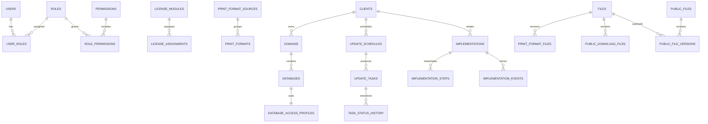

# Modelo relacional objetivo de Portal SAG Web para SQL Server

Proyecto: **Portal SAG Web**

Revisión: **2026-07-16**

Estado: **diseño físico canónico para construcción no productiva; Cosmos DB continúa como fuente de verdad**

Motor confirmado: **SQL Server 2019 Standard Edition, compatibilidad 150**

Este documento reemplaza las propuestas anteriores. Fue contrastado con el código, permisos, tests, los 17 contenedores y el snapshot productivo estructural del 2026-07-16 (2.890 documentos). El DDL debe evitar funciones exclusivas de SQL Server 2022. La matriz canónica está en [COSMOS_TO_SQL_MIGRATION_MATRIX.md](COSMOS_TO_SQL_MIGRATION_MATRIX.md).

## 1. Decisiones de arquitectura

1. **Migración gradual, no reescritura simultánea.** Cosmos permanece como sistema de registro hasta completar carga, reconciliación, pruebas de comportamiento, ensayo de cutover y aprobación.
2. **Clave interna estrecha + ID público conservado.** Las entidades de volumen usan PK clustered `BIGINT IDENTITY`; cada ID Cosmos se conserva sin cambios en `source_id NVARCHAR(150)` con índice unique. API, auditoría y reconciliación siguen usando `source_id`; las FK internas usan `BIGINT`. Catálogos pequeños con claves estables (`roles`, `permissions`, `environments`) conservan PK textual. Esto evita propagar claves anchas por todos los índices sin perder comparabilidad ni rollback.
3. **Normalizar datos operativos.** Arrays, scopes, roles, responsables, destinatarios y licencias se convierten en tablas hijas. JSON se reserva para auditoría sanitizada, staging y metadata extensible.
4. **Conservar snapshots históricos.** Nombres de cliente, dominio, compañía, destino y correo del actor se mantienen en tareas/auditoría aunque también exista FK.
5. **Key Vault sigue siendo la fuente de secretos.** SQL guarda solo nombres de secretos o hashes; nunca contraseñas SMTP/SQL, refresh tokens, JWT secrets ni valores recuperados de Key Vault.
6. **Los archivos salen de la fila operativa.** Los Base64 actuales de formatos y descargas se migran al bucket privado S3/MinIO del proveedor. SQL conserva metadata, hash, versión, bucket y object key. Esto evita inflar backups, log y memoria de Azure Functions.
7. **Permisos y visibilidad son conceptos separados.** Los permisos de opción/acción se normalizan; la visibilidad de tareas por tipo queda en el rol con niveles `none`, `assigned`, `all`.
8. **Historial append-only.** Auditoría, eventos de implementación e historial de estados no se actualizan ni eliminan desde la cuenta runtime.
9. **UTC para timestamps; `DATE` para fechas de negocio.** Zona de negocio `America/Bogota`; `DATETIME2(3)` en UTC y `DATE` para fechas de tarea/inicio/fin.
10. **Concurrencia explícita.** Entidades mutables llevan `row_version ROWVERSION`; tareas, sesiones, roles, rate limits y settings deben usar actualización optimista o transacciones.

## 2. Límites de datos

| Área | Esquema | Responsabilidad |
|---|---|---|
| Identidad y autorización | `security` | Usuarios, roles, permisos, sesiones y controles temporales de seguridad. |
| Maestros | `core` | Clientes, dominios, bases de datos, ambientes y perfiles de acceso. |
| Licenciamiento | `licensing` | Catálogo de módulos y asignaciones a cliente/dominio/base. |
| Programación | `scheduling` | Actualizaciones programadas, alcance, frecuencia, asignación y recordatorios. |
| Trabajo operativo | `workflow` | Tareas, fuentes, responsables, transiciones y alertas ya enviadas. |
| Configuración | `settings` | Correo, alertas, recordatorios globales y destinatarios. |
| Contenido | `content` | Fuentes/formatos de impresión, descargas forzadas, archivos públicos inline y versiones. |
| Notificaciones | `notifications` | Intentos/envíos e idempotencia de correo. |
| Implementaciones | `implementation` | Futuro flujo de migración, cliente nuevo y módulo especial. |
| Auditoría | `audit` | Registro global sanitizado e inmutable. |
| Migración | `migration` | Corridas, documentos raw, staging, errores y reconciliación. |

## 3. Convenciones físicas

- Entidades migradas: `*_key BIGINT IDENTITY` como PK clustered y `source_id NVARCHAR(150)` como alternate key unique. Roles `NVARCHAR(80)` y permisos `NVARCHAR(160)` mantienen clave textual estable.
- Las respuestas API exponen `source_id` como `id`; nunca exponen las claves internas.
- Texto de usuario: `NVARCHAR`; email máximo 254; URL/host máximo 500.
- Columnas normalizadas persistidas o escritas por repositorio: `LOWER(TRIM(valor))`; dominios además sin `/` final.
- Estados maestros: `active`, `inactive`, `deleted` con `CHECK`.
- Campos de trazabilidad: `created_at`, `created_by`, `updated_at`, `updated_by`; soft-delete agrega `deleted_at`, `deleted_by`.
- `created_by`/`performed_by` son snapshots de actor y aceptan `system`; por ello no todos deben ser FK estricta.
- Índices únicos de nombres/códigos se filtran con `WHERE status <> 'deleted'`.
- Todas las FK operativas usan claves internas y `NO ACTION`. Las cascadas de negocio se ejecutan en transacciones de servicio para conservar los efectos actuales y generar auditoría.
- SQL Server 2019 no dispone de un tipo JSON nativo: JSON permitido usa `NVARCHAR(MAX)` + `CHECK (ISJSON(...) = 1)`.
- Índices de listas usan orden estable `(business_sort_columns, *_key)` para soportar keyset pagination; `OFFSET` queda limitado a páginas pequeñas de administración.

## 4. Modelo lógico resumido

## 5. Esquema `security`

Salvo catálogos textuales indicados, cada tabla raíz descrita con `id` lógico implementa `*_key BIGINT IDENTITY` + `source_id`; los nombres siguientes son el contrato lógico.

### `security.users`

PK `user_key`; AK `source_id`. Columnas: `display_name`, `email`, `email_normalized`, `active`, `password_hash`, `password_updated_at`, `password_expires_at`, `must_change_password`, `token_version`, `last_login_at`, hashes/fechas del reset, auditoría y `row_version`.

Reglas: email normalizado único; `token_version >= 0`; nunca exponer hashes. Campos MFA retirados se conservan únicamente en el snapshot raw cifrado durante la retención aprobada, no en el modelo operativo.

### `security.roles`, `security.permissions`, `security.role_permissions`, `security.user_roles`

- `roles`: PK `role_id NVARCHAR(80)`; `name`, `active`, `system_role`, `protected_role`, `domain_task_visibility`, `database_task_visibility`, auditoría y `row_version`.
- `permissions`: PK `permission_key`; `module_id`, `option_id`, `action_id`, etiquetas y `active`. Se siembra desde `PERMISSION_CATALOG`.
- `role_permissions`: PK `(role_id, permission_key)`.
- `user_roles`: PK `(user_id, role_id)` con fecha/actor de asignación.

Checks: ambos niveles de visibilidad en `none|assigned|all`. `super_admin` se protege en servicio y mediante trigger/procedimiento de administración; sus permisos y visibilidad no se pueden reducir. Los IDs heredados se transforman durante migración: `admin→super_admin`, `formatos_impresion.admin→print_formats_admin`; los otros IDs retirados solo se migran después de resolver referencias según la política aprobada.

### `security.auth_sessions`

PK `session_key`; AK `source_id`; FK `user_key`; `refresh_token_hash`, `token_version`, `created_at`, `last_used_at`, `expires_at`, `revoked_at`, `revoked_reason`, FK nullable `replaced_by_session_key`, `row_version`.

Índices: `(user_id, revoked_at, expires_at)` y `expires_at`. No se migran sesiones Cosmos: en cutover se fuerza nuevo login. SQL debe soportar rotación atómica y detección de replay.

### `security.rate_limits`

PK `rate_limit_key`; AK `source_id` hash; `scope`, `key_type`, `attempt_count`, `window_started_at`, `blocked_until`, `expires_at`, `updated_at`, `row_version`. Índices en `expires_at` y `(scope, key_type, blocked_until)`. Empieza vacía en cutover y requiere job de purga. Para el MVP confirmado se usará SQL; Redis queda como evolución si la carga distribuida lo justifica.

Estado runtime 2026-07-21: los stores SQL de sesiones y rate limits están implementados detrás de `SQL_SECURITY_RUNTIME_ENABLED=false`. La rotación de refresh token, el enlace al descendiente y la detección de reutilización usan una transacción `SERIALIZABLE`; el consumo de límites bloquea el rango de la clave seudónima con `UPDLOCK,HOLDLOCK`. Esta base no autoriza activación: login, password/reset, auditoría y outbox deben cambiar como una sola unidad transaccional antes del ensayo.

## 6. Esquema `core`

### `core.environments`

Catálogo: `production`, `test`, `demo`. `all` no es un ambiente operativo y solo aparece en filtros de configuración/programación.

### `core.clients`

PK/AK estándar (`client_key`/`source_id`); `external_id`, `name`, `name_normalized`, `status`, `notes`, auditoría/soft-delete/`row_version`. Únicos filtrados para `external_id` no nulo y `name_normalized` mientras no esté eliminado.

### `core.domains` y `core.domain_assignees`

- `domains`: PK/AK estándar; FK `client_key`; `domain_name`, `domain_name_normalized`, `environment_id`, `current_web_version`, `status`, notas, última actualización operativa, snapshots de auditoría y `row_version`.
- `domain_assignees`: PK `(domain_id,user_id)`.

Reglas: URL HTTPS; dominio normalizado único entre no eliminados; FK compuesta `(id,client_id)` disponible para validar que bases y tareas pertenezcan al mismo cliente.

### `core.database_access_profiles`

PK `access_profile_key`; public ID `UNIQUEIDENTIFIER`; `server_host_port`, `initial_catalog`, `sql_user_id`, `password_secret_name`, `connection_fingerprint BINARY(32)`, `active`, auditoría y `row_version`. Es dato técnico sensible: no se incluye en vistas generales. La huella SHA-256 usa exactamente la representación canónica host/puerto + catálogo + usuario de `duplicateValidation.ts`, nunca la contraseña.

Esta tabla permite reutilizar el patrón seguro para accesos de bases maestras y para accesos de pruebas/producción del futuro módulo de implementaciones. La unicidad de fingerprint es filtrada por `active=1`: perfiles pertenecientes a bases eliminadas permanecen inactivos y retienen su `password_secret_name`, por lo que no se fusionan con el perfil activo aunque host/catálogo/usuario coincidan.

### `core.databases` y `core.database_assignees`

- `databases`: PK/AK estándar; FK compuesta `domain_key,client_key`; FK `access_profile_key`; `company_name`, `environment_id`, `current_db_version`, `status`, notas, última actualización, auditoría/soft-delete/`row_version`.
- `database_assignees`: PK `(database_id,user_id)`.

Único filtrado recomendado: `(client_id, domain_id, company_name_normalized, environment_id)` para no eliminados. El adaptador SQL reconstruye el DTO `dbAccess` sin revelar la contraseña.

## 7. Esquema `licensing`

### `licensing.license_modules`

PK/AK estándar; `name`, normalizado, `code`, normalizado, `description`, `status`, notas, auditoría/soft-delete/`row_version`. Nombre y código únicos filtrados.

### `licensing.license_assignments`

PK/AK estándar; FK `module_key`; `target_type`; FKs nullable `client_key`, `domain_key`, `database_key`; `environment_id`; `status`; auditoría/soft-delete/`row_version`.

Un `CHECK` exige exactamente el destino correspondiente:

- `client`: solo `client_id`.
- `domain`: `client_id + domain_id`.
- `database`: `client_id + domain_id + database_id`.

Índice único filtrado por módulo/destino/ambiente mientras no esté eliminado. `ClientRecord.licenseModuleIds[]` se migra a asignaciones de nivel `client`; no se mantiene una segunda tabla que pueda divergir. Si también existe un documento `licenseAssignments` equivalente, la carga lo reconcilia por prioridad y registra conflictos.

## 8. Esquema `scheduling`

### `scheduling.update_schedules`

PK `schedule_key`; AK `source_id`; FK `client_key`; FK nullable `domain_key`; `name`; `target_type`; `frequency_type`; `every_n_weeks`, `interval_days`, `day_of_month`; `start_date`, `end_date`, `timezone`; FKs de rol general/dominio/base; `database_reminder_recipients_mode`; `selection_mode`, `manual_target_types`, `assignment_mode`, `origin`; `active`; `completed_at`, `completed_reason`; `deleted_at`, `deleted_by`; `notes`; snapshots de nombres; auditoría y `row_version`.

Checks condicionales:

- `once`: sin parámetros de recurrencia.
- `weekly`: `every_n_weeks >= 1` y al menos un weekday.
- `interval`: `interval_days >= 1`.
- `monthly`: `day_of_month BETWEEN 1 AND 31`.
- `manual`: sin recurrencia automática.
- `end_date IS NULL OR end_date >= start_date`.
- roles asignados deben estar activos, tener `updates.tasks.view` y visibilidad compatible con el tipo de tarea.

### Tablas hijas de programación

| Tabla | PK y propósito |
|---|---|
| `schedule_weekdays` | `(schedule_id,kind,weekday)`; `kind=weekly|preferred`. |
| `schedule_targets` | `(schedule_id,target_type,target_id)`; conserva `targetIds[]` legado. |
| `schedule_assignees` | `(schedule_id,assignment_kind,user_id)`; general/dominio/base. |
| `schedule_reminder_settings` | PK/FK `schedule_id`; habilitado, hora y modo de destinatarios. |
| `schedule_reminder_days` | `(schedule_id,days_before)`. |
| `schedule_reminder_emails` | `(schedule_id,email_normalized)`. |
| `scope_groups` | PK `scope_group_key BIGINT`; FK schedule/client; `include_all_domains`. |
| `scope_domains` | PK `scope_domain_key BIGINT`; FK group/domain; `include_all_databases`. |
| `scope_databases` | `(scope_domain_id,database_id)`. |
| `licensing_scope` | PK/FK schedule; match any/all, ambiente, tipos y solo activos. |
| `licensing_scope_modules` | `(schedule_id,module_id)`. |
| `licensing_excluded_domains` | `(schedule_id,domain_id)`. |
| `licensing_excluded_databases` | `(schedule_id,database_id)`. |

Excluir un dominio no excluye sus bases; excluir una base no excluye el dominio. Los scopes explícitos y los de licenciamiento son mutuamente excluyentes según `selection_mode`.

Schedules referenciados nunca se borran físicamente en SQL. Una eliminación funcional crea tombstone (`active=0`, `deleted_at/by`) para que tareas e historial conserven integridad.

## 9. Esquema `workflow`

### `workflow.update_tasks`

PK `task_key`; AK `source_id`; `dedupe_key`; `task_date`; `task_bucket` legado; FKs `client_key`, `domain_key`, `database_key` nullable; source-ID snapshots de cliente/dominio/destino; `is_historical_orphan`; `target_type`; `primary_schedule_source_id` y FK nullable `primary_schedule_key`; FK `assigned_role_id`; `status`; `result`, notas; campos de completar/bloquear/resolver/reabrir; snapshots de nombres; auditoría y `row_version`.

Reglas:

- `domain`: `database_id IS NULL` y el destino es `domain_id`.
- `database`: `database_id IS NOT NULL` y pertenece al mismo dominio/cliente.
- estados: `pending|in_progress|completed|failed|blocked|cancelled|reopened`.
- índice único `dedupe_key` no nulo; antes de imponerlo se reconcilian históricos.
- regla funcional principal: una tarea por `target_type + target + task_date`. `completed` bloquea duplicados; `cancelled/result=obsolete` puede reactivarse.
- `sources[]`/`workflow.task_sources` es la relación autoritativa muchos-a-muchos. `rootScheduleId` determina `primary_schedule_key` para presentación/compatibilidad cuando el schedule existe. `scheduleId` sintético legado se conserva en staging/raw y nunca se fuerza como FK falsa.
- Dedupe se impone sobre destino físico (`domain_key` o `database_key`) + `task_date`, incluyendo canceladas; una `cancelled/obsolete` se reactiva en vez de insertar otra fila.
- Los 32 grupos históricos duplicados se consolidan: se conserva la fila no obsoleta (o la obsoleta más reciente si todas lo son), los otros IDs van a `task_source_aliases` y sus estados a history inferido.
- FK master faltante solo se permite para tareas importadas terminales con `is_historical_orphan=1` y snapshots obligatorios. Tareas nuevas/no terminales exigen integridad completa.

### Tablas hijas de tareas

| Tabla | Propósito |
|---|---|
| `task_assignees(task_id,user_id)` | Normaliza responsables. |
| `task_sources` | Orígenes con `schedule_source_id` obligatorio y `schedule_key` nullable para referencias históricas ausentes. |
| `task_source_aliases` | IDs Cosmos supersedidos por consolidación de dedupe; unique alias→task. |
| `task_status_history` | Cada transición con estado anterior/nuevo, acción, comentario, actor y metadata sanitizada. |
| `task_reminders` | Envío por tipo/días/fecha. |
| `task_reminder_recipients` | Destinatarios por recordatorio, no JSON. |
| `task_overdue_alerts(task_id,sent_date)` | Idempotencia diaria de vencidos. |

Cambiar estado de tarea y actualizar `current_*_version/last_updated_*` en el maestro se ejecuta en una sola transacción SQL. Resolver bloqueo conserva los timestamps/motivos anteriores en `task_status_history`.

## 10. Esquema `settings`

El documento único `appSettings/email-alerts` se normaliza para permitir constraints y referencias a roles:

| Tabla | Contenido |
|---|---|
| `email_settings` | Fila singleton: proveedor, remitente, URL frontend, SMTP no secreto, referencia Key Vault, defaults y banderas. |
| `default_reminder_days` | Días globales antes de tarea. |
| `alert_recipient_roles` | `(alert_kind,role_id)` para `overdue` y `blocked`. |
| `alert_recipient_emails` | Correos custom normalizados por tipo. |
| `overdue_alert_weekdays` | Días de envío semanal. |
| `blocked_reminder_days` | Días después del bloqueo. |
| `administrative_reminders` | `sag_web_version` y `whats_new`: regla, día, hora, timezone, asunto y estado. |
| `administrative_reminder_recipients` | Correos por recordatorio. |

Campos heredados (`overdueAlertRecipientsMode`, `customAdminAlertEmails`) se transforman a destinatarios explícitos. `overdue_alert_last_sent_period` se conserva además de las filas de notificación para compatibilidad, pero la idempotencia final debe descansar en un índice único de notificaciones.

## 11. Esquema `content`

### Archivos y versiones

`content.files`: PK `file_key`; public ID `UNIQUEIDENTIFIER`; `storage_provider`, `container_name`, `blob_name`, `original_name`, `mime_type`, `byte_length`, `sha256 BINARY(32)`, `created_at/by`. Cada carga es inmutable. No se guarda Base64 ni URL SAS.

### Formatos de impresión

- `print_format_sources`: PK/AK estándar; nombre normalizado único, estado/activa, auditoría/soft-delete. No tiene descripción porque el maestro solo identifica el tipo de fuente.
- `print_formats`: PK/AK estándar; `print_format_source_key` conserva la fuente primaria compatible con `fuenteId`; nombre/normalizado; descripción; tamaño y personalizado; `requires_license`; FK módulo nullable; `legacy_import_code`, `legacy_import_status`, `legacy_variant` nullable; activo/estado; auditoría/soft-delete/`row_version`.
- `print_format_source_assignments`: puente muchos-a-muchos `(print_format_key,print_format_source_key)`; `display_order`; fecha/actor. Debe existir entre 1 y 50 fuentes distintas por formato y siempre incluir la fuente primaria. El nombre del formato es único dentro de cada fuente asignada.
- `print_format_files`: PK `(print_format_id,version_no)`; FK archivo; `is_current`, fecha/actor. Índice único filtrado garantiza una versión actual.

Checks: PDF; tamaño máximo actual 1.500.000 bytes; si tamaño=`personalizado`, detalle obligatorio; si requiere licencia, módulo activo obligatorio. `fuenteIds[]` se normaliza al puente y `fuenteNombres[]` se deriva por join; los registros históricos sin array generan una asignación desde `fuenteId`. Los tres campos `legacy_*` preservan metadata de los 37 formatos históricos, no participan en identidad, filtros ni unicidad y no se crean en registros nuevos salvo importación controlada.

### Descargas públicas

- `public_download_sections`: tabla histórica de la migración Cosmos. No forma parte del runtime ni admite nuevas escrituras.
- `public_download_documents`: nombre físico conservado por compatibilidad; representa descargas forzadas. PK/AK estándar; `section_key` nullable/legacy; `asset_kind=document|video`; título; slug normalizado único para `/public/downloads/{slug}`; descripción; activo/estado; auditoría/soft-delete/`row_version`.
- `public_download_files`: PK `(document_id,version_no)`; FK archivo; versión actual única.

Todos los endpoints de Descargas Públicas responden `Content-Disposition: attachment`, incluso para videos. Se conservan los endpoints históricos con sección como aliases, pero el runtime identifica la descarga solo por su slug global.

### Archivos públicos inline

- `public_files`: PK/AK estándar; `asset_kind=image|video|pdf`; título; slug normalizado único para `/public/files/{slug}`; descripción; activo/estado; auditoría/soft-delete/`row_version`.
- `public_file_versions`: PK `(public_file_key,version_no)`; FK a `content.files`; una sola versión actual.

Estos endpoints responden `Content-Disposition: inline`. Solo permiten PDF, imágenes JPG/PNG/GIF/WebP y videos MP4/M4V/MOV/WebM con firma validada. HTML y SVG se excluyen para evitar contenido activo bajo el contexto público del portal.

## 12. Esquema `notifications`

- `email_notifications`: PK/AK estándar; `notification_type`; `entity_type`, `entity_source_id`; `idempotency_key` único; `period`, `send_date`; `subject`; `status` (`pending|claimed|sent|failed|skipped`); `attempt_count`, `claimed_at`, `claim_expires_at`, `next_attempt_at`, `attempted_at`, `sent_at`, `provider_message_id`; error sanitizado; metadata JSON validada; auditoría/`row_version`.
- `email_notification_recipients`: PK `(notification_id,email_normalized)`; tipo `to|cc|bcc`, nombre, resultado y error sanitizado.

Transforma los documentos actuales `administrative_reminder` y `blocked_task_reminder`. Los recordatorios embebidos en tareas también se preservan en `workflow`, porque allí forman parte del estado operativo de la tarea.

Para reset de contraseña, el outbox no almacena el token, la URL ni el cuerpo del correo. La solicitud crea de forma idempotente una instrucción `password_notification` con plantilla fija y destinatario; el worker generará el token de un solo uso al reclamar la fila, persistirá únicamente su hash y mantendrá el token en memoria durante el envío.

## 13. Esquema `audit`

`audit.audit_logs`: PK `audit_log_key BIGINT IDENTITY`; AK `source_id`; tipo/source ID de entidad; FKs opcionales de cliente/dominio; snapshots de nombres; acción; actor/source ID/email; `performed_at`; `before_json`, `after_json`, `metadata_json` con `ISJSON`; clasificación/sanitización y versión de esquema.

Índices: fecha descendente; `(entity_type,entity_id,performed_at)`; `(client_id,performed_at)`; `(action,performed_at)`. La cuenta runtime recibe `INSERT` y `SELECT` autorizada, pero no `UPDATE`/`DELETE`. Antes de exportar se ejecuta el saneamiento SEC-009.

Estado runtime 2026-07-21: existen writers reutilizables que insertan auditoría ya saneada y outbox dentro de la transacción de negocio. La validación read-only del destino confirmó trigger append-only, unique de idempotencia, índice del worker, guard JSON, permiso runtime de `INSERT` y denegaciones explícitas de `UPDATE/DELETE` sobre auditoría. Aún no están activados desde los handlers Cosmos.

## 14. Esquema `implementation` (reservado desde ahora)

Este esquema corresponde a la especificación `docs/implementaciones/*`. No existe aún en el runtime, por lo que **no hay documentos Cosmos que migrar**, pero reservarlo evita rediseñar la base poco después del cutover.

| Tabla | Datos principales y reglas |
|---|---|
| `implementations` | Tipo `migration|new_client|special_module`; estado, etapa, versión de plantilla, cliente opcional, datos de cliente, completitud, atención, última actividad, cierre/rechazo, auditoría/rowversion. |
| `implementation_assignees` | `(implementation_id,responsibility)` a usuario; sales/support/lead. |
| `implementation_companies` | NIT/nombre/contacto/logo/admin email/BD original y FKs a perfiles de acceso de pruebas/producción. |
| `implementation_modules` | `(implementation_id,module_id,module_kind)` licensed/special. |
| `implementation_module_users` | Usuarios del módulo especial. |
| `implementation_decisions` | Clave, valor, nota, actor y fecha. |
| `implementation_steps` | Clave estable, etapa/fase/orden, instrucciones, rol responsable, blocking, estado, evidencia y datos de bloqueo/cierre. Unique `(implementation_id,step_key)`. |
| `implementation_events` | Timeline append-only; tipo, resumen, metadata sanitizada, actor y fecha. |
| `module_test_catalog` | Módulo especial y si exige ambiente de pruebas; editable y auditable. |

Las plantillas del proceso siguen versionadas en código. Al crear una implementación se copian sus pasos; cambiar la plantilla no modifica instancias existentes. Correos del flujo usan `notifications.email_notifications` con FK opcional `implementation_id`. Eventos y auditoría se escriben en la misma transacción que la acción de negocio; el envío externo usa patrón outbox para no perder ni duplicar correos.

## 15. Esquema `migration`

- `migration_runs`: fuente, destino, timestamps, snapshot, versión de app/esquema, estado y conteos.
- `raw_documents`: PK `(run_id,source_container,source_id)`; JSON original cifrado en reposo, SHA-256, estado/error.
- una `stage_*` por cada contenedor de negocio: users, roles, clients, domains, databases, license modules/assignments, schedules, tasks, settings, notifications, fuentes/formatos, public downloads y audit.
- `id_mappings`: solo para nuevas IDs técnicas generadas durante normalización.
- `validation_results`: severidad, regla, esperado, real, detalle y resolución.
- `reconciliation_counts`: conteos y hashes por contenedor/tabla/run.

`securityRateLimits` y `authSessions` se exportan solo para conteo/diagnóstico si la política lo autoriza; no se cargan al target operativo.

## 16. Índices mínimos de consulta

| Consulta real | Índice |
|---|---|
| Login | `users(email_normalized)` unique. |
| Roles de usuario | `user_roles(user_id)` include `role_id`. |
| Jerarquía cliente | `domains(client_id,status)`, `databases(domain_id,status)`. |
| Lista de tareas | `(status,task_date,target_type)`, `(assigned_role_id,status,task_date)`, assignees por usuario. |
| Dedupe | `update_tasks(dedupe_key)` unique filtrado y destino/fecha. |
| Timers | schedules `(active,start_date,end_date)`, tasks `(task_date,status)`, sessions/rate limits por expiración. |
| Auditoría | fecha, entidad/id, cliente y acción. |
| Descargas y archivos públicos | slug único filtrado por cada espacio de endpoint; versión actual única. |
| Formatos públicos | fuente/activo y módulo de licencia. |
| Bandeja futura | implementations `(status,current_stage_id,attention_required,last_activity_at)`. |

## 17. Transacciones críticas

1. Crear/editar cliente, dominio o base + auditoría.
2. Eliminar cliente/dominio/base + desactivar/cancelar dependencias + auditoría.
3. Crear/editar programación + reemplazar todas sus tablas hijas + auditoría.
4. Generar tareas: lock lógico por fecha/ventana, inserción idempotente, fuentes y cierre de `once`.
5. Cambiar estado de tarea + historial + actualización de versión del maestro + auditoría/outbox.
6. Editar rol + permisos/visibilidad; asignar rol; validar referencias antes de desactivar/eliminar.
7. Reemplazar archivo: crear blob y metadata, cambiar versión actual, auditar; limpieza compensatoria si falla SQL.
8. Enviar correo: crear outbox/idempotency; worker envía y actualiza resultado.

## 18. Estrategia de migración

1. Aprobar motor, collation, red, storage de archivos, retención y RPO/RTO.
2. Crear base vacía y schemas; ejecutar DDL versionado con herramienta de migraciones.
3. Exportar snapshot consistente de los 17 contenedores, metadatos de partición y conteos; sanear auditoría.
4. Cargar `migration.raw_documents` y staging sin transformar.
5. Ejecutar validaciones pre-carga: fechas, IDs, roles, duplicados, jerarquía, secretos, archivos, referencias y tareas huérfanas.
6. Cargar catálogos, seguridad, core, licencias, scheduling, workflow, settings/content/notifications y audit.
7. Extraer Base64, verificar firma/tamaño/hash, cargar Blob y crear versiones SQL. No borrar Base64 fuente hasta aprobación.
8. Reconciliar conteos, IDs, sumas de arrays normalizados, hashes y salidas funcionales.
9. Ejecutar aplicación en modo shadow-read sobre SQL sin responder desde SQL; comparar DTOs sanitizados.
10. Ensayar cutover completo, rollback y recuperación de timers.
11. Ventana final: pausar escrituras/timers, export incremental, cargar, validar, cambiar repositorios, forzar login y reactivar timers una sola vez.
12. Mantener Cosmos read-only durante la retención acordada; retirar solo tras aprobación.

## 19. Criterios de aceptación de datos

- 100% de IDs de negocio presentes o explicados en `validation_results`.
- 0 secretos en raw compartido, tablas operativas, logs o reportes; solo hashes/referencias.
- Conteos por estado y contenedor reconciliados.
- Arrays normalizados reconciliados: roles, asignados, targets, weekdays, scopes, fuentes y destinatarios.
- 0 FK huérfanas críticas; placeholders históricos solo con aprobación explícita.
- 0 duplicados de email, externalId, dominio, módulos, dedupeKey y slugs tras resolución documentada.
- Misma visibilidad de tareas por usuario/rol en Cosmos y SQL.
- Misma generación de tareas para ventanas de prueba, incluida reactivación de `obsolete` y cierre de `once`.
- Ningún correo duplicado después del cutover.
- Todos los archivos descargan con mismo hash, MIME y nombre; PDFs abren correctamente.
- Reportes, dashboard, listas, filtros, paginación y auditoría devuelven resultados equivalentes.

## 20. Decisiones que requieren aprobación antes del DDL final

| Decisión | Recomendación |
|---|---|
| Plataforma | Cerrada: SQL Server 2019 Standard, compatibility 150, provisto en `PortalSAGWeb`. |
| Archivos | Bucket privado S3/MinIO + metadata SQL; no `VARBINARY(MAX)`. |
| Rate limiting | Tabla SQL con `ROWVERSION` y purga para el MVP; reevaluar Redis con métricas de contención/escala horizontal. |
| Settings | Modelo normalizado descrito; conservar JSON raw solo en migración. |
| Implementaciones | Crear schema/tablas ahora vacíos o reservar DDL en una migración inmediatamente posterior. |
| Auditoría | Migrarla desde día 1 y mantener append-only. |
| Corte | Forzar logout; no migrar sesiones activas. |
| Retención Cosmos | Mínimo una ventana de rollback y aprobación formal; sugerido 30–90 días read-only. |

No se debe crear el DDL productivo hasta cerrar estas decisiones y contar con el inventario real del ambiente Cosmos. El siguiente entregable técnico es el script versionado de schema + importadores repetibles, no cambios directos manuales en producción.
